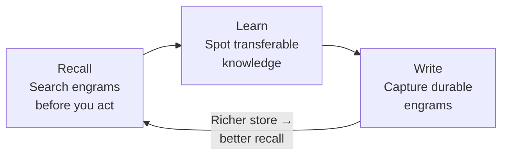
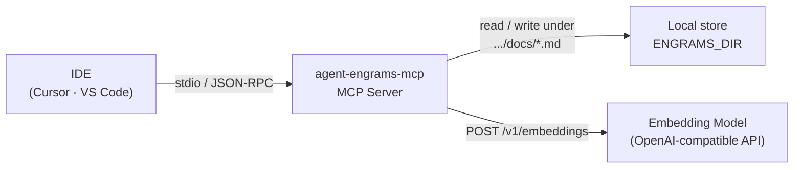

# Agent Engrams MCP Server

## Table of contents

- [Introduction](#introduction)
- [Architecture](#architecture)
- [On-disk layout](#on-disk-layout)
- [Quick Start](#quick-start)
- [Tools](#tools)
- [Configuration Reference](#configuration-reference)
- [Engram Format](#engram-format)
- [Transport Modes](#transport-modes)
- [Development](#development)
- [License](#license)

## Introduction

**What this is.** Agent Engrams MCP is a [Model Context Protocol](https://modelcontextprotocol.io/) server that gives coding agents a **durable, shared memory** for transferable engineering knowledge. Agents store lessons as structured markdown documents called **engrams** on your machine; the server indexes them with embeddings so agents can **search by meaning**, not just filenames. Your IDE (Cursor, VS Code, or any MCP-aware client) talks to the server over stdio; the server reads and writes files locally and calls an OpenAI-compatible embedding API when indexing and searching.

**Why it matters.** Agent sessions are short and context windows are finite. Without a memory that survives across tasks and projects, every session starts from zero: the same debugging tricks, API quirks, and architectural lessons get rediscovered-or missed-again and again. A shared engram store turns one-off insights into **reusable** knowledge: your agent (and others using the same store) can **recall** what already worked before inventing a new dead end.

**The learning flywheel.** The engram system is designed around a loop that gets stronger the more it is used honestly:

1. **Recall** - Before diving into a non-trivial task, search the store. Prior work may already answer the question.
2. **Learn** - During the task, notice **transferable** patterns (would this help on a *different* project?). That is engram-worthy.
3. **Write** - Capture those insights in structured engrams so the next recall is richer.

Each high-quality write makes the next search more useful; that encourages more search, which surfaces more opportunities to learn and write. That self-reinforcing loop is the **flywheel effect**. It stalls if the store fills with noise (low-quality writes), if agents skip search (duplicate effort), or if everything is written indiscriminately (diluted results). Quality beats quantity.



The flywheel is a habit, not a one-time setup: the MCP server is the **machinery** that stores, embeds, and retrieves engrams so that loop can run every day.

## Architecture



The IDE spawns the MCP server as a child process. When an agent writes or searches engrams, the server reads and writes markdown under the store's `docs/` folder and calls an OpenAI-compatible embedding endpoint to build query vectors and score matches.

## On-disk layout

`ENGRAMS_DIR` (and the `dir` field in `mcp.json`) is the **store root**, not the folder that holds markdown directly. The server creates this layout on startup if it is missing:

| Path | Purpose |
|------|---------|
| `$ENGRAMS_DIR/docs/` | Engram markdown files (`.md`) - this is what gets indexed and searched. |
| `$ENGRAMS_DIR/index.json` | Persisted vector index (embeddings + excerpts + metadata). Same general shape as **pi-agent-engrams** (`dimensions`, `embeddingModelId`, `providerFingerprint`, `entries` keyed by absolute `.md` paths; we also write `version: 3` for their tooling). **Load** succeeds only when the file's top-level fields match the current config: `dimensions`, `embeddingModelId`, and `providerFingerprint` must all match; otherwise the file is skipped and embeddings are rebuilt from `docs/`. The `version` field is **not** used when loading. |
| `$ENGRAMS_DIR/index/` | Reserved directory (optional); **not** where `index.json` lives. |

If you previously set `ENGRAMS_DIR` to a path ending in `/docs`, that still works: the server treats it as a **legacy** docs-only path (root = parent directory, docs = that path).

## Quick Start

### Prerequisites

- **Node.js** 20+
- An **OpenAI-compatible embedding API** (local or remote). Examples: Ollama, LM Studio, vLLM, OpenAI.

### 1. Install

```bash
npm install -g agent-engrams-mcp
```

### 2. Configure your IDE

Pick your editor and paste the JSON block into the indicated file. Adjust the `env` values to match your embedding provider.

#### Cursor

Add to **`~/.cursor/mcp.json`** (global) or **`<project>/.cursor/mcp.json`** (per-project):

```json
{
  "mcpServers": {
    "agent-engrams": {
      "command": "npx",
      "args": ["agent-engrams-mcp", "--stdio"],
      "env": {
        "ENGRAMS_DIR": "~/.config/agent-engrams-mcp",
        "EMBEDDER_DIMENSIONS": "512",
        "EMBEDDER_TYPE": "openai",
        "EMBEDDER_BASE_URL": "http://localhost:8000/v1",
        "EMBEDDER_API_KEY": "your-api-key",
        "EMBEDDER_MODEL": "Qwen3-Embedding-0.6B-4bit-DWQ"
      }
    }
  }
}
```

#### Visual Studio Code

Add to your **VS Code settings (JSON)**:

```json
{
  "mcp.servers": {
    "agent-engrams": {
      "command": "npx",
      "args": ["agent-engrams-mcp", "--stdio"],
      "env": {
        "ENGRAMS_DIR": "~/.config/agent-engrams-mcp",
        "EMBEDDER_DIMENSIONS": "512",
        "EMBEDDER_TYPE": "openai",
        "EMBEDDER_BASE_URL": "http://localhost:8000/v1",
        "EMBEDDER_API_KEY": "your-api-key",
        "EMBEDDER_MODEL": "Qwen3-Embedding-0.6B-4bit-DWQ"
      }
    }
  }
}
```

### 3. Restart your IDE

After saving the config, restart (or reload MCP servers) so the IDE picks up the new server. You should see **agent-engrams** listed among your MCP servers.

That's it - your agent now has persistent memory.

## Tools

The server exposes three tools to the agent:

| Tool | Description |
|------|-------------|
| **write-engram** | Capture a piece of transferable knowledge as a structured markdown file. |
| **search-engrams** | Semantic search across all engrams by natural-language query, with optional metadata filters (category, tags, scope, durability). |
| **reindex** | Force a full re-index of every engram on disk. |

Three **seed engram resources** ship with the server to guide agents on writing and searching effectively.

## Configuration Reference

All settings can be provided via **environment variables** (shown above in the IDE snippets), a **JSON config file**, or **CLI arguments**. Environment variables take precedence over the config file.

### Environment Variables

| Variable | Description | Default |
|----------|-------------|---------|
| `ENGRAMS_DIR` | Store root directory (`docs/` holds markdown; `index/` reserved) | `~/.config/agent-engrams-mcp` |
| `EMBEDDER_TYPE` | Provider type: `openai`, `bedrock`, `ollama` | `openai` |
| `EMBEDDER_BASE_URL` | Base URL for the embedding API | - |
| `EMBEDDER_MODEL` | Embedding model name | `Qwen3-Embedding-0.6B-4bit-DWQ` |
| `EMBEDDER_API_KEY` | API key for the embedding provider | - |
| `EMBEDDER_DIMENSIONS` | Embedding vector dimensions | `512` |
| `MCP_CONFIG` | Path to a JSON config file (overrides XDG default) | `~/.config/agent-engrams-mcp/mcp.json` |
| `XDG_CONFIG_HOME` | Base config directory | `~/.config` |
| `USE_STDIO` | Force stdio transport | - |
| `PORT` | HTTP server port (HTTP mode only) | `3000` |

### Config File

If you prefer a config file over env vars, create `~/.config/agent-engrams-mcp/mcp.json`:

```json
{
  "dir": "~/.config/agent-engrams-mcp",
  "dimensions": 512,
  "provider": {
    "type": "openai",
    "model": "Qwen3-Embedding-0.6B-4bit-DWQ",
    "baseUrl": "http://localhost:11434/v1",
    "apiKey": "your-api-key"
  },
  "minSearchScore": 0.40
}
```

A starter file is included in the repo:

```bash
mkdir -p ~/.config/agent-engrams-mcp
cp mcp.json.example ~/.config/agent-engrams-mcp/mcp.json
```

#### Provider Examples

<details>
<summary>OpenAI-compatible (default)</summary>

```json
{
  "type": "openai",
  "model": "text-embedding-3-small",
  "baseUrl": "https://api.openai.com/v1",
  "apiKey": "sk-..."
}
```
</details>

<details>
<summary>Bedrock</summary>

```json
{
  "type": "bedrock",
  "profile": "default",
  "region": "us-east-1",
  "model": "amazon.titan-embed-text-v2:0"
}
```
</details>

<details>
<summary>Ollama</summary>

```json
{
  "type": "ollama",
  "url": "http://localhost:11434",
  "model": "nomic-embed-text"
}
```
</details>

### CLI Arguments

Override any setting when starting the server directly:

```bash
npm start -- --dir=/path/to/store-root --dimensions=768
npm start -- --provider='{"type":"openai","model":"text-embedding-3-small","baseUrl":"https://api.openai.com/v1","apiKey":"sk-..."}'
```

## Engram Format

Engrams are markdown files with YAML frontmatter:

```markdown
---
Category: debugging
Tags: async, testing, jest
Durability: permanent
Scope: universal
Agent: system
Date: 2024-01-01
Source: Task #123
---

# Title of the Engram

## Context

What situation triggered this learning? Include specific details.

## Insight

What was learned? What is the non-obvious part? Be specific.

## Application

**Trigger:** When to apply this knowledge
**Anti-trigger:** When NOT to apply this knowledge

## Supersedes

None
```

## Transport Modes

| Mode | How to run | Use case |
|------|-----------|----------|
| **stdio** (default for IDEs) | `npx agent-engrams-mcp --stdio` | Cursor, VS Code, Claude Desktop |
| **HTTP** | `npm start` (port 3000) | Remote or multi-client setups |

## Architecture

The application follows a clean architecture pattern with clear separation of concerns:

### Core Components

- **`src/index.ts`** - Entry point with CLI argument parsing, config loading, and service instantiation
- **`src/mcp-server-service.ts`** - MCP server service that encapsulates server initialization and tool registration
- **`src/engram-service.ts`** - Application service layer for engram operations
- **`src/abstractions.ts`** - Interface definitions for external dependencies (file system, HTTP fetch)
- **`src/embedder.ts`** - Embedding provider implementations (OpenAI, Bedrock, Ollama)
- **`src/index-store.ts`** - Index management and search logic
- **`src/config.ts`** - Configuration loading and management
- **`src/frontmatter.ts`** - Markdown parsing and engram rendering

### Dependency Injection

External dependencies are injected via interfaces:
- `IFileSystem` - File system operations (defaults to `NodeFileSystem`)
- `IHttpFetch` - HTTP fetch operations (defaults to `createHttpFetch()`)

This enables easy mocking for unit tests.

### Testability

The refactored code is designed for easy testing:
- No global state - all state is encapsulated within class instances
- All external dependencies are injectable via interfaces
- Test helpers provide easy setup for test instances
- Tests can run without network access or file system

## Development

```bash
npm install
npm run build        # compile TypeScript
npm run typecheck    # type check only
npm run lint         # lint
npm run format       # check formatting
```

## License

MIT
